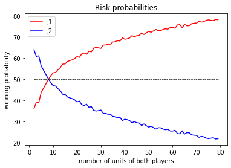

# Welcome to the stadistics of risk!

The probabilities to win in a classical risk battle.

## Rules for the battle

Compare the highest die each of are rolled. If the attackers is higher, the defender loses one army from the territory under attack. But if the defender's die is higher than the attacker, he loses one army from the territory.

The attacker will roll 3 dice. He must have at least one more army in the territory than the number of dice is rolling, in the case he has 3 armies, he will play with 2 dice. The defender will roll 2 dice. Likewise, he must have at least 2 armies on the territory under attack, if he have only 1 then he plays with 1 die. 

## risk_visual.py

## risk_data.py

Attacking units | Defending units | Winner | Winning probability
------------- | ------------- | ------------- | -------------
3 | 3 | defender | 59'85%
5 | 5 | defender | 55'98%
8 | 8 | defender | 50'51%
10 | 10 | attacker  | 52'54 %
100 | 100 | attacker  | 81'34 %
75 | 80 | attacker  | 66'71%
100 | 110 | attacker  | 62'88%
100 | 120 | defender | 59'05%

